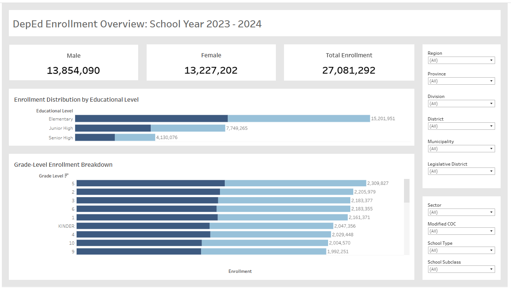

# DepEd Enrollment Data Dashboard  

## Project Overview  
With the recent change in administration, the Department of Education (DepEd) aims to gain a clearer understanding of the Philippine education system. A key factor in this effort is analyzing annual enrollment data collected through the Learner Information System.

Currently, the system lacks a real-time dashboard, requiring manual data extraction for analysis. To enhance data-driven decision-making, this project focuses on:

- **Cleaning and manipulating data** using Python to ensure accuracy and consistency
- Developing an **interactive dashboard** to visualize key enrollment statistics
- Implementing **hierarchical filtering** for seamless data exploration.
- Integrating **data visualizations** for better insights.
- Ensuring **user-friendly** navigation to enhance accessibility for stakeholders.

## My Contributions  

### Data Cleaning (Python)  
- Removed unnecessary rows to maintain dataset relevance  
- Replaced null values with **"Not Applicable"** instead of dropping rows  
- Identified and removed **duplicate records** for data integrity  
- Handled invalid entries (e.g., **"n/a," empty strings**)  
- Dropped columns with excessive missing data that had minimal impact on dashboarding  
- Standardized data formatting:  
  - Converted text to **uppercase** for consistency  
  - Resolved inconsistent abbreviations  
  - Removed unnecessary punctuation  
- Reshaped the dataset from **wide to long format** for better analysis  
- Exported data with special character handling to prevent encoding issues  

### Dashboard Development (Tableau)  
- Built an **interactive Tableau dashboard** to allow DepEd personnel to:  
  - View topline enrollment data at a glance  
  - Apply **filters and segmentations** for education program and policy planning  

## Technologies Used  
- **Python** (Data Cleaning & Preprocessing)  
- **Pandas** (Data Manipulation)  
- **Tableau** (Data Visualization)  

## Dashboard Preview  

*You can view the Tableau dashboard [here](https://public.tableau.com/views/try_17425717667680/Dashboard1?:language=en-US&:sid=&:redirect=auth&:display_count=n&:origin=viz_share_link).*