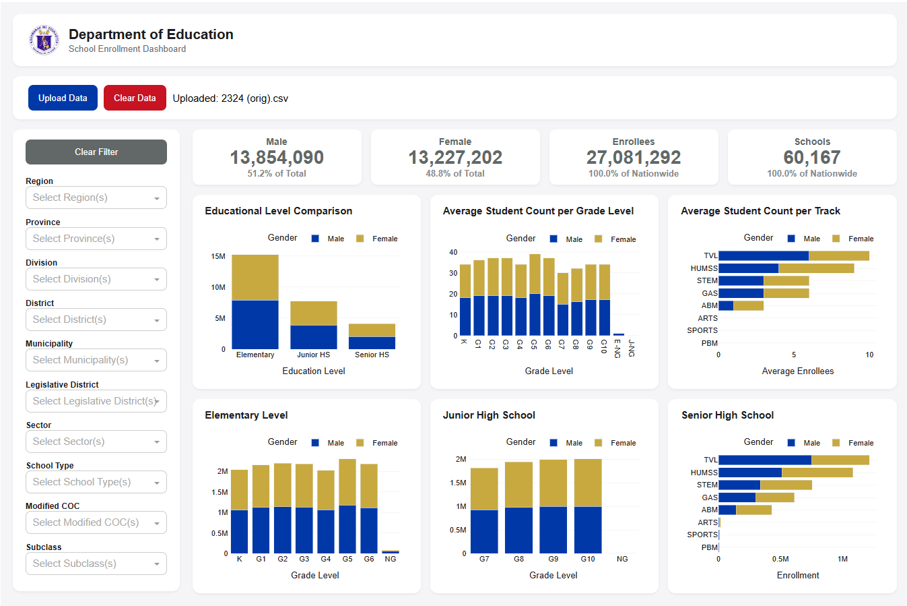
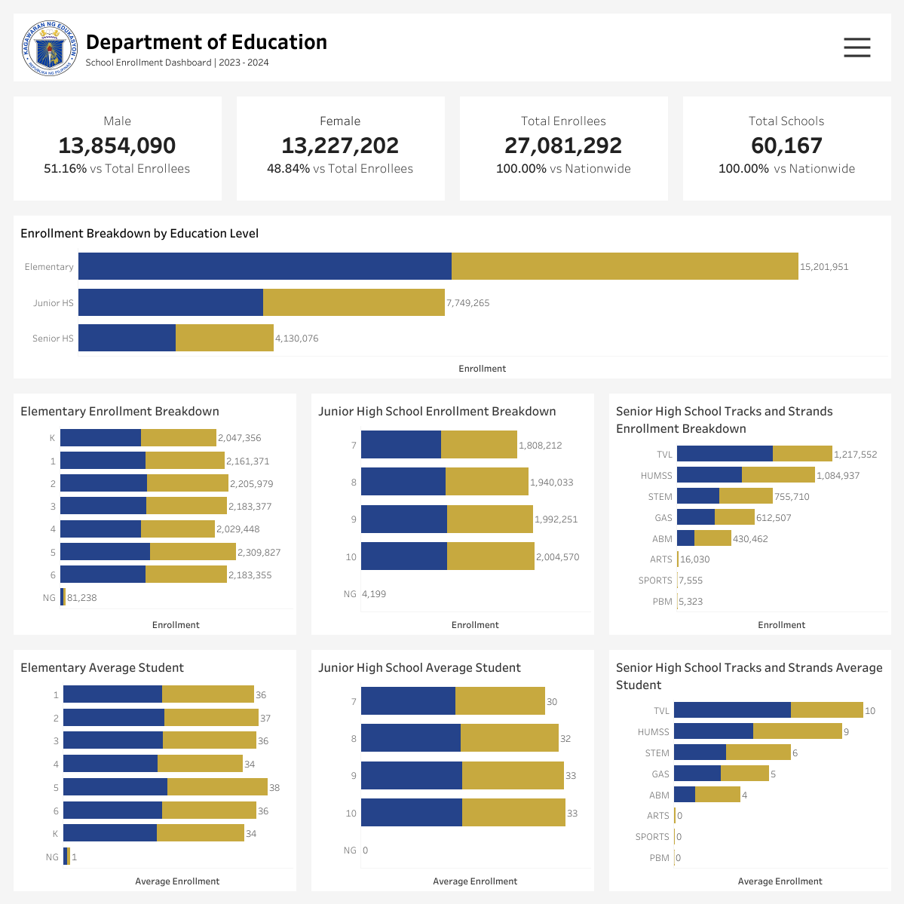

# K-12 Enrollment Dashboard  

### **Table of Contents:**
- [Project Overview](#project-overview)
- [Data Structure](#data-structure)
- [Work Highlights](#work-highlights)
- [Technologies Used](#technologies-used)
- [Dashboard Preview](#dashboard-preview)

## Project Overview  
With the recent change in administration, the Department of Education (DepEd) aims to gain a clearer understanding of the Philippine education system. A key factor in this effort is analyzing annual enrollment data collected through the Learner Information System.

Currently, the system lacks a real-time dashboard, requiring manual data extraction for analysis. To enhance data-driven decision-making, this project focuses on:

- **Cleaning and manipulating data** using Pandas in Python
- Developing an **interactive dashboard** to visualize key enrollment statistics.
- Implementing **geographical area and school attributes filtering** for seamless data exploration.

## Data Structure
Enrollment database structure as seen below consists of 67 columns with a total row count of 60,172 records.

## Work Highlights 

### Data Cleaning *(Python)*  
- Removed unnecessary rows to maintain dataset relevance  
- Replaced null values with **"Not Applicable"** instead of dropping rows  
- Identified and removed **duplicate records** for data integrity  
- Handled invalid entries (e.g., **"n/a," empty strings**)  
- Dropped columns with excessive missing data that had minimal impact on dashboarding  
- Standardized data formatting:  
  - Converted text to **uppercase** for consistency  
  - Resolved inconsistent abbreviations  
  - Removed unnecessary punctuation  
- Reshaped the dataset from **wide to long format** for better analysis  
- Exported data with special character handling to prevent encoding issues

*See data cleaning details [here](data_cleaning_tableau-dashboarding.ipynb).*

### Data Verification *(Excel)*
- Used pivot tables and slicers on the original dataset to verify data computations in Plotly Dash and Tableau visualizations.

### Dashboard Development *(Plotly-Dash and Tableau)*
- Built an **interactive dashboard** to allow DepEd personnel to:  
  - Quickly explore and analyze enrollment trends
  - Apply **filters** for education program and policy planning

#### Plotly-Dash Dashboard Preview  

*See Plotly-Dash dashboard [here](Enrollment_Plotly-Dash_Script.py).*

#### Tableau Dashboard Preview

*See Tableau dashboard [here](https://public.tableau.com/views/try_17425717667680/Dashboard1?:language=en-US&:sid=&:redirect=auth&:display_count=n&:origin=viz_share_link).*